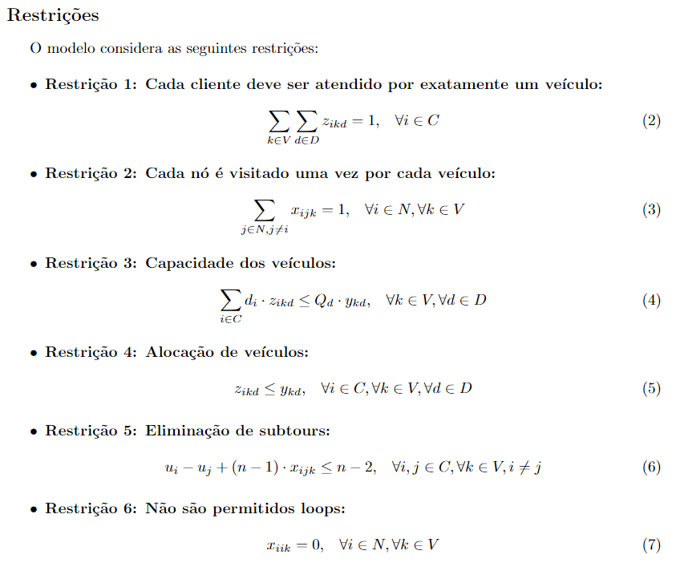
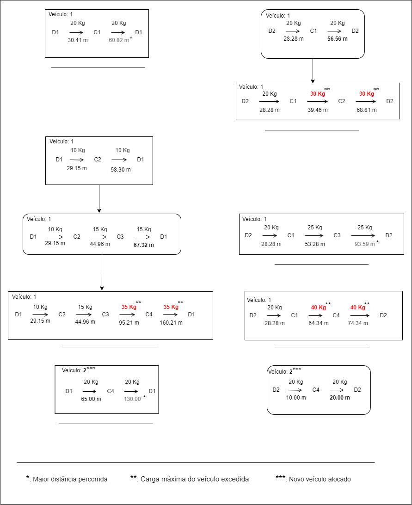
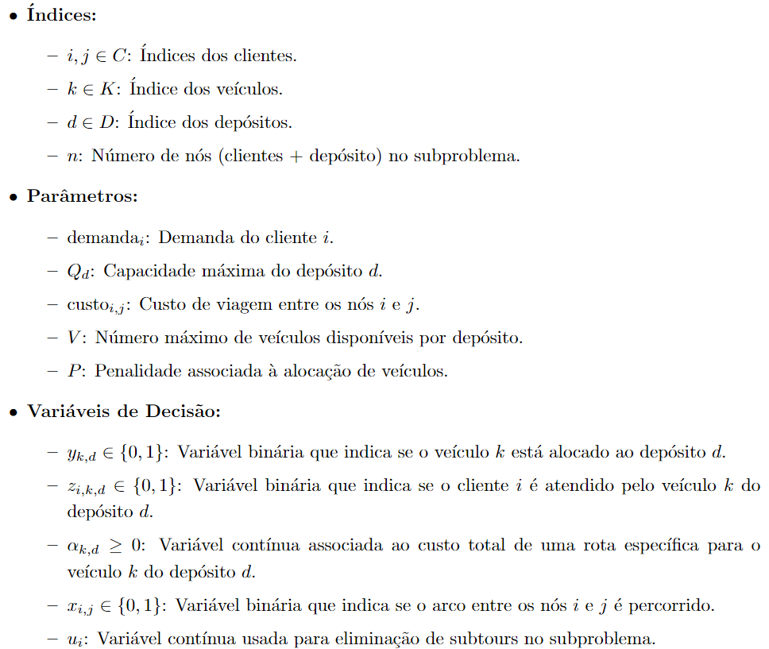

# MDVRP-LBBD

O Problema de Roteamento de Veículos com Múltiplos Depósitos (**MDVRP**, do inglês *Multi-Depot Vehicle Routing Problem*) é uma extensão do Problema de Roteamento de Veículos (**VRP**). Trata-se de um problema de otimização cujo objetivo é determinar as rotas ótimas para múltiplos veículos, partindo de diferentes depósitos, para atender às demandas de clientes localizados em regiões distintas, garantindo o retorno ao depósito de origem. A solução visa minimizar o custo total, seja em termos do número de veículos necessários ou da distância percorrida, enquanto assegura que cada demanda de cliente seja completamente atendida.

## Definição do problema

Conforme apresenta [Surekha and Sumathi (2011)][3], o MDVRP pode ser formulado matematicamente como um modelo de programação inteira mista. Seja $G = (V, A)$ um grafo completo, onde $V = \{i \in I, j \in J\}$ representa o conjunto de nós, com $I$ indicando os depósitos e $J$ os clientes. O conjunto $A = \{(i,j) : i, j \in V, i \neq j\}$ denota os arcos que conectam todos os pares de nós. Define-se $K$ como o conjunto de veículos disponíveis, $V_i$ como a capacidade do depósito $i \in I$, e $d_j$ como a demanda do cliente $j \in J$. \\




## Instâncias

Com o objetivo de observar o comportamento do modelo implementado, foram selecionadas as 5 primeiras instâncias do conjunto presente em [neo.lcc][1].
> As instâncias podem ser encontradas também em [./datasets/C-mdvrp][2].

### Estrutura do Arquivo

> Os campos destacados com o caracter `*` represemtam as informações utilizadas para a elaboração da solução.

A primeira linha dos arquivos contém:

- **type m n t**

- **type**:
  - `0` (VRP)
  - `1` (PVRP)
  - `2` (MDVRP)
  - `3` (SDVRP)
  - `4` (VRPTW)
  - `5` (PVRPTW)
  - `6` (MDVRPTW)
  - `7` (SDVRPTW)
- **m**: número de veículos*
- **n**: número de clientes*
- **t**: número de dias (PVRP), depósitos (MDVRP) ou tipos de veículos (SDVRP)*

#### Informações Adicionais

As próximas `t` linhas contêm, para cada dia (ou depósito ou tipo de veículo), as seguintes informações:

- **D Q**

- **D**: duração máxima de uma rota
- **Q**: carga máxima de um veículo*

#### Informações dos Clientes

As linhas seguintes contêm, para cada cliente, as seguintes informações:

- **i x y d q f a list e l**

- **i**: número do cliente*
- **x**: coordenada x*
- **y**: coordenada y*
- **d**: duração do serviço
- **q**: demanda*
- **f**: frequência de visita
- **a**: número de combinações de visita possíveis
- **list**: lista de todas as combinações de visita possíveis
- **e**: início da janela de tempo (tempo mais cedo para começar o serviço), se houver
- **l**: fim da janela de tempo (tempo mais tarde para começar o serviço), se houver

### Definição

As instâncias foram classificadas em três categorias: `Pequeno`, `Médio` e `Grande`, com os seguintes parâmetros:

- **Pequeno**
  - Veículos: 4
  - Clientes: 15
  - Depósitos: 2
  - Capacidade: 80

- **Médio**
  - Veículos: 4
  - Clientes: 25
  - Depósitos: 4
  - Capacidade: 80

- **Grande**
  - Veículos: 4
  - Clientes: 50
  - Depósitos: 4
  - Capacidade: 80

> As instâncias podem ser encontradas em [./datasets/C-mdvrp/Ajustados][4]

Os parâmetros foram estabelecidos após uma análise das instâncias, levando em consideração que o **MDVRP** é um problema NP-Difícil. Isso implica que o tempo necessário para resolver o problema pode crescer exponencialmente com o aumento das variáveis.

> O problema NP-Difícil refere-se à dificuldade de encontrar uma solução ótima em tempo polinomial, o que significa que é computacionalmente intensivo para grandes instâncias.

Foi realizado um cuidado especial para garantir que a `capacidade` e a `quantidade de veículos` fossem suficientes para atender a todas as demandas do problema. Especificamente, a soma das demandas \( D \) de todos os clientes \( C \) deve ser menor ou igual ao produto da quantidade de veículos \( V \), a quantidade de depósitos \( d \) e a capacidade de cada veículo (80).

Matematicamente, isso pode ser representado como:

$$
    \sum_{i=1}^{C} d_i \leq V \times D \times 80
$$

Considerando as coordenadas $x$ e $y$ de cada cliente, a matriz de custo foi desenvolvida com base na distância euclidiana entre os clientes.

A distância euclidiana $d_{ij}$ entre dois clientes $i$ e $j$ é calculada pela seguinte equação:

$$
  d_{ij} = \sqrt{(x_i - x_j)^2 + (y_i - y_j)^2}
$$

## *Toy Problem*

Considerando uma instância com 2 depósitos, 2 veículos, 4 clientes e carga máxima de 25 unidades por veículo, as figuras abaixo ilustram um exemplo de fluxo para encontrar uma solução ótima para o problema.




## *Logic-Based Benders Decompositions (LBBD)*

A decomposição de Benders é uma técnica de otimização utilizada para resolver problemas que podem ser decompostos em um problema mestre e um ou mais subproblemas. A ideia central da decomposição é resolver iterativamente o problema mestre e, com base em sua solução, resolver os subproblemas para gerar cortes (restrições) que são adicionados ao problema mestre.

### Descrição das Variáveis e Índices



### Problema Mestre

O problema mestre objetiva minimizar o custo total da operação, que é composto por dois componentes principais: o custo associado à distância percorrida pelos veículos, representado por $\alpha_{k,d}$, e uma penalidade fixa $P$ para cada veículo $k$ alocado ao depósito $d$.


As variáveis $y_{k,d}$ e $z_{i,k,d}$ são binárias, indicando decisões de alocação de veículos e atendimento de clientes, respectivamente. A variável $\alpha_{k,d}$ é contínua e não negativa, representando o custo associado à distância percorrida pelo veículo $k$ para atender os clientes do depósito $d$.

#### Restrições do Problema Mestre

Além de decidir a alocação de veículos aos depósitos, o problema mestre assegura que cada cliente seja atendido e que as capacidades dos depósitos não sejam excedidas. O custo total inicial é uma estimativa que é refinada ao longo das iterações com a adição de cortes derivados dos subproblemas.

- **Restrição 1:**

$$
  \sum_{k \in K} \sum_{d \in D} z_{i,k,d} = 1, \quad \forall i \in C
$$

  _Cada cliente $i$ deve ser atendido por exatamente um veículo $k$ de algum depósito $d$._

- **Restrição 2:**

$$
  \sum_{i \in C} \text{demanda}_i \cdot z_{i,k,d} \leq Q_d \cdot y_{k,d}, \quad \forall k \in K, \forall d \in D
$$

  _A carga total alocada ao veículo $k$$ no depósito $d$ não pode exceder a capacidade $Q_ d$ do depósito._

- **Restrição 3:**

$$
  \sum_{k \in K} y_{k,d} \leq V, \quad \forall d \in D
$$

  _O número de veículos alocados ao depósito $d$ não pode exceder $V$._

- **Restrição 4:**

  $
    \alpha_{k,d} \geq \text{custo}_{i,d} \cdot z_{i,k,d}, \quad \forall i \in C, \forall k \in K, \forall d \in D
  $

    _A variável $\alpha_{k,d}$ deve ser maior ou igual ao custo associado ao atendimento do cliente $i$ pelo veículo $k$ no depósito $d$._

- **Restrição 5:**

  $
    z_{i,k,d} \leq y_{k,d}, \quad \forall i \in C, \forall k \in K, \forall d \in D
  $

    _Um cliente só pode ser atendido por um veículo alocado ao depósito $d$ se o veículo $k$ estiver realmente alocado ao depósito $d$._

As restrições do problema mestre asseguram que cada cliente seja atendido, que a capacidade dos veículos e depósitos seja respeitada, e que a alocação de veículos seja realizada de forma eficiente. Essas restrições garantem que a solução do problema mestre seja factível e que possa ser refinada pelos cortes provenientes dos subproblemas.

### Subproblema

O subproblema determina as rotas dos veículos designados a cada depósito, buscando minimizar a distância necessária para atender os clientes.


O termo $custo_{i,j}$ $\cdot x_{i,j}$ representa o custo associado ao arco $(i,j)$ percorrido. Este é um problema de roteamento de veículos (VRP), cujo objetivo é otimizar a rota para minimizar os custos, respeitando as restrições de capacidade dos veículos.


A variável binária $x_{i,j}$ indica se o arco $(i,j)$ é utilizado na solução, enquanto $u_i$ é uma variável contínua associada à eliminação de subciclos no problema de roteamento de veículos.

#### Restrições do Subproblema

As restrições do subproblema garantem que o percurso de cada veículo atenda a todos os clientes atribuídos sem violar as capacidades dos veículos.

- **Restrição 1:**

$$
\sum_{j \in N} x_{i,j} = 1, \quad \forall i \in N
$$

  _Cada nó (cliente ou depósito) deve ser visitado exatamente uma vez por um veículo._

- **Restrição 2:**

$$
\sum_{i \in N} x_{i,j} = 1, \quad \forall j \in N
$$

  _Cada nó deve ser deixado exatamente uma vez por um veículo._

- **Restrição 3:**

$$
u_i - u_j + (n-1) \cdot x_{i,j} + (n-3) \cdot x_{j,i} \leq n-2, \quad \forall (i,j) \in A, i \neq j
$$

  _Restrição de eliminação de subciclos no subproblema._

- **Restrição 4:**

$$
  x_{i,j} + x_{j,i} \leq 1, \quad \forall (i,j) \in A
$$

  _Cada arco entre dois nós $i$ e $j$ pode ser percorrido em apenas uma direção._

- **Restrição 5:**

$$
  \sum_{j \in N} \text{demanda}_i \cdot x_{i,j} \leq Q_d, \quad \forall i \in C
$$

  _A demanda total dos clientes visitados por um veículo não pode exceder a capacidade do depósito_


- **Restrição 6**
$$
  y_{k-1, d} \geq y_{k, d}, \quad \forall d \in D, \forall k \in \{2, \ldots, |V|\}
$$

  _A variável $y_{k,d}$ , que indica se o veículo $k$ está alocado ao depósito $d$, deve respeitar a ordem de simetria._

- **Restrição 7**
  
$$
  \alpha_{k-1, d} \geq \alpha_{k, d}, \quad \forall d \in D, \forall k \in \{2, \ldots, |V|\}
$$

  _A variável $\alpha_{k,d}$ , que representa algum valor associado ao veículo $k$ no depósito $d$, deve respeitar a ordem de simetria._

### Cortes de Benders

Os cortes de Benders são gerados a partir das soluções do subproblema. Existem dois tipos principais de cortes: cortes de **factibilidade** e cortes de **otimalidade**.

- **Corte de Otimalidade:**

    Os cortes de otimalidade melhoram a estimativa do custo total fornecida pelo problema mestre.

$
  \alpha_{k,d} \geq \text{objeto}_{\text{tsp}} - \text{objeto}_{\text{tsp}} \cdot \sum_{i \in C} (1 - z_{i,k,d}), \quad \forall k \in K, \forall d \in D
$

  _Garante que a solução encontrada no subproblema respeita a função objetivo do mestre._

- **Corte de Factibilidade:**

    Os cortes de factibilidade asseguram que a solução obtida pelo problema mestre seja viável e garante que todas as restrições sejam respeitadas nos subproblemas.

$$
  \sum_{i \in C} \text{demanda}_i \cdot z_{i,k,d} \leq Q_d \cdot y_{k,d}, \quad \forall k \in K, \forall d \in D
$$

  _Garante que a capacidade do veículo não é excedida na solução do subproblema._

## Execução

Para executar os modelos, siga os seguintes passos:
1. Certifique-se de ter o python 3 instalado;
2. Para executar os modelos, você deve estar na pasta `./src`;
3. Use um dos seguintes comandos no terminal:
```bash
  python .\LBBD.py
```
```bash
  python .\Gurobi_MDVRP.py
```

Para poder testar separadamente cada instância, deve-se alterar a variável `__name__` para `__teste__`:

```python
  __name__ = str('__teste__')
```

A variável `filePath` indica qual instância será executada.
```python
  filePath = r'../datasets/C-mdvrp/toy2'
```

A função `solve_model`, além de receber a instância, aceita mais 2 parâmetros, `execution_minutes`, o qual limita o tempo de execução do modelo, e `write_results`, para informar se será gerado um arquivo com os resultados do modelo.

> Os resultados já obtidos podem ser encontrados em [./src/Resultados][5]


[1]: https://neo.lcc.uma.es/vrp/vrp-instances/multiple-depot-vrp-instances/
[2]: https://github.com/JoseBieco/MDVRP-LBBD/tree/master/datasets/C-mdvrp
[3]: https://citeseerx.ist.psu.edu/document?repid=rep1&type=pdf&doi=fcff394938381091eccc1c346373a7b5adccc06b
[4]: https://github.com/JoseBieco/MDVRP-LBBD/tree/master/datasets/C-mdvrp/Ajustados
[5]: https://github.com/JoseBieco/MDVRP-LBBD/tree/master/src/Resultados
